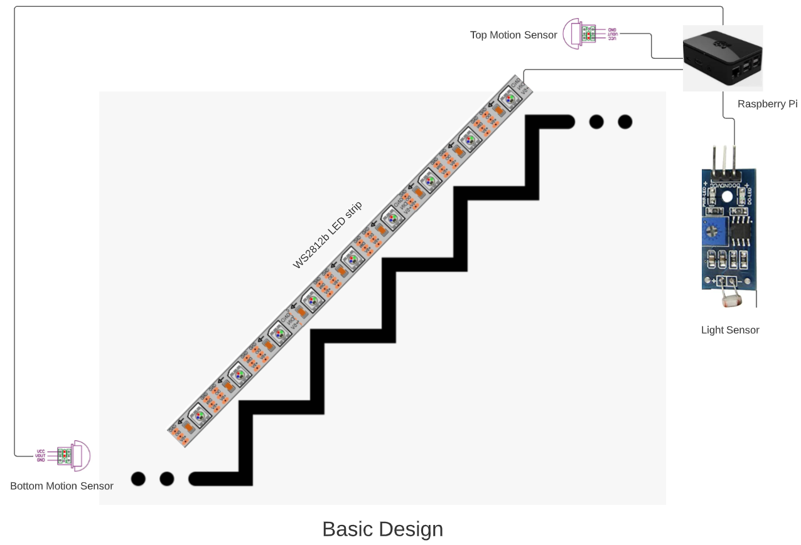
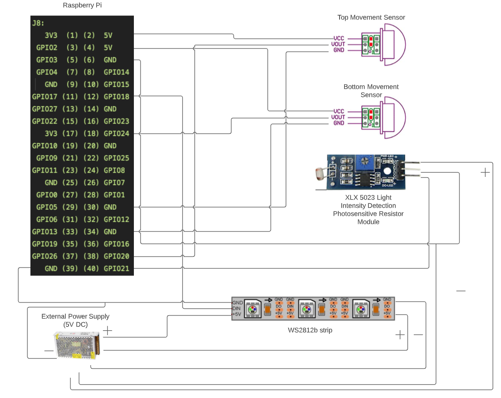

# raspberry-pi-ws2812b-stair-lighting

## Overview
This is a simple raspberry pi project to use a WS2812b LED strip for lighting a flight of stairs. The design assumes that the LED strip extends from the top of the stairs to the bottom. It also assumes that the raspberry pi is at the top of the stairs too.  There is one motion detector at the top of the stairs and one motion detector at the bottom.



## Hardware
Raspberry Pi Model 3B  V1.2

## OS
```bash
tennis@stairs:~ $ cat /etc/*-release
PRETTY_NAME="Raspbian GNU/Linux 11 (bullseye)"
NAME="Raspbian GNU/Linux"
VERSION_ID="11"
VERSION="11 (bullseye)"
VERSION_CODENAME=bullseye
ID=raspbian
ID_LIKE=debian
HOME_URL="http://www.raspbian.org/"
SUPPORT_URL="http://www.raspbian.org/RaspbianForums"
BUG_REPORT_URL="http://www.raspbian.org/RaspbianBugs"
```

## Wiring diagram
First, lets establish which raspberry pi we're using by invoking the `pinout` command.
```bash
tennis@stairs:~ $ pinout
,--------------------------------.
| oooooooooooooooooooo J8     +====
| 1ooooooooooooooooooo        | USB
|                             +====
|      Pi Model 3B  V1.2         |
|      +----+                 +====
| |D|  |SoC |                 | USB
| |S|  |    |                 +====
| |I|  +----+                    |
|                   |C|     +======
|                   |S|     |   Net
| pwr        |HDMI| |I||A|  +======
`-| |--------|    |----|V|-------'

Revision           : a02082
SoC                : BCM2837
RAM                : 1GB
Storage            : MicroSD
USB ports          : 4 (of which 0 USB3)
Ethernet ports     : 1 (100Mbps max. speed)
Wi-fi              : True
Bluetooth          : True
Camera ports (CSI) : 1
Display ports (DSI): 1

J8:
   3V3  (1) (2)  5V
 GPIO2  (3) (4)  5V
 GPIO3  (5) (6)  GND
 GPIO4  (7) (8)  GPIO14
   GND  (9) (10) GPIO15
GPIO17 (11) (12) GPIO18
GPIO27 (13) (14) GND
GPIO22 (15) (16) GPIO23
   3V3 (17) (18) GPIO24
GPIO10 (19) (20) GND
 GPIO9 (21) (22) GPIO25
GPIO11 (23) (24) GPIO8
   GND (25) (26) GPIO7
 GPIO0 (27) (28) GPIO1
 GPIO5 (29) (30) GND
 GPIO6 (31) (32) GPIO12
GPIO13 (33) (34) GND
GPIO19 (35) (36) GPIO16
GPIO26 (37) (38) GPIO20
   GND (39) (40) GPIO21

For further information, please refer to https://pinout.xyz/
```



## Parts List
[Ximimark AM312 Mini Pyroelectric PIR Human Sensor](https://www.amazon.com/gp/product/B07G1S5LS5/ref=ppx_yo_dt_b_asin_title_o07_s02?ie=UTF8&psc=1)

[BTF-LIGHTING WS2812B](https://www.amazon.com/gp/product/B01CDTEG1O/ref=ppx_yo_dt_b_asin_title_o07_s01?ie=UTF8&psc=1)

[BTF-LIGHTING 20 Pairs JST SM 3 Pin Connectors](https://www.amazon.com/gp/product/B01DC0KIT2/ref=ppx_yo_dt_b_asin_title_o07_s01?ie=UTF8&psc=1)

[SHNITPWR 5V DC Power Supply](https://www.amazon.com/gp/product/B07TSKK4FR/ref=ppx_yo_dt_b_asin_title_o07_s01?ie=UTF8&th=1)

[hunhun 10-Pack 6.6ft/ 2Meter U Shape LED Aluminum Channel System](https://www.amazon.com/gp/product/B07F923CXW/ref=ppx_yo_dt_b_asin_title_o07_s00?ie=UTF8&psc=1)

[Wirefy 110 PCS Solder Seal Wire Connectors Kit](https://www.amazon.com/gp/product/B01M0EZBYQ/ref=ppx_yo_dt_b_asin_title_o00_s00?ie=UTF8&th=1)

[Breadboard Jumper wire Ribbon Cables](https://www.amazon.com/gp/product/B06XRV92ZB/ref=ppx_yo_dt_b_asin_title_o09_s00?ie=UTF8&psc=1)

[Raspberry Pi 3 Model B B+ A+ Plus Power Supply](https://www.amazon.com/gp/product/B01N336XEU/ref=ppx_yo_dt_b_asin_title_o02_s00?ie=UTF8&th=1)

[Junction Box Enclosure Case](https://www.amazon.com/gp/product/B07DYYTSDR/ref=ppx_yo_dt_b_asin_title_o01_s00?ie=UTF8&psc=1)

[Extension Cable Line Wire for WS2812b](https://www.amazon.com/gp/product/B06Y4716V7/ref=ppx_yo_dt_b_asin_title_o01_s02?ie=UTF8&psc=1)

[3M Double Sided Tape Mounting Tape](https://www.amazon.com/gp/product/B082WW5NSM/ref=ppx_yo_dt_b_asin_title_o08_s00?ie=UTF8&th=1)

[Raspberry Pi 3 B+ Case](https://www.amazon.com/gp/product/B079M96KWZ/ref=ppx_yo_dt_b_asin_title_o06_s01?ie=UTF8&psc=1)

[Raspberry Pi 3 Model B Board](https://www.amazon.com/Raspberry-Pi-MS-004-00000024-Model-Board/dp/B01LPLPBS8/ref=sr_1_3?keywords=raspberry+pi+3&qid=1644695196&sprefix=rasp%2Caps%2C135&sr=8-3)

## Links
[Raspberry Pi 3 pinout](http://pinout.xyz/)

[Wiring options for RPi](https://learn.adafruit.com/neopixels-on-raspberry-pi/raspberry-pi-wiring)

[The wiring option I used](https://learn.adafruit.com/assets/63928)

[Python Lib installation](https://learn.adafruit.com/neopixels-on-raspberry-pi/python-usage)

[Motion sensor info](https://projects.raspberrypi.org/en/projects/physical-computing/11)

[GPIO Library doc](https://gpiozero.readthedocs.io/en/stable/api_input.html#motionsensor-d-sun-pir)

[NeoPixel Uber Guide](https://gpiozero.readthedocs.io/en/stable/api_input.html#motionsensor-d-sun-pir)

[How to start a script at boot time](https://www.dexterindustries.com/howto/run-a-program-on-your-raspberry-pi-at-startup/)

[Wiring color code standards](https://www.allaboutcircuits.com/textbook/reference/chpt-2/wiring-color-codes/)

[Amperage calculation](https://electronics.stackexchange.com/questions/396313/ws2812b-5050-60-led-per-meter-300-led-strip-power-issues)

